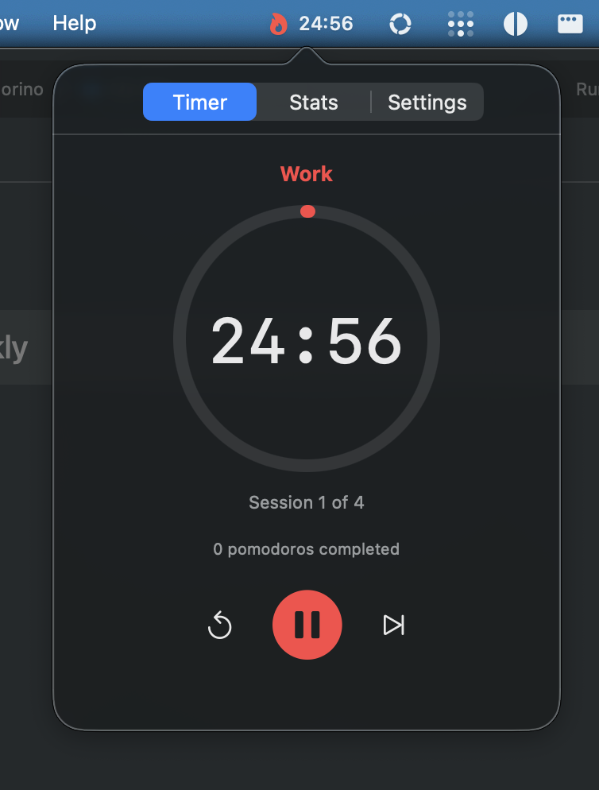
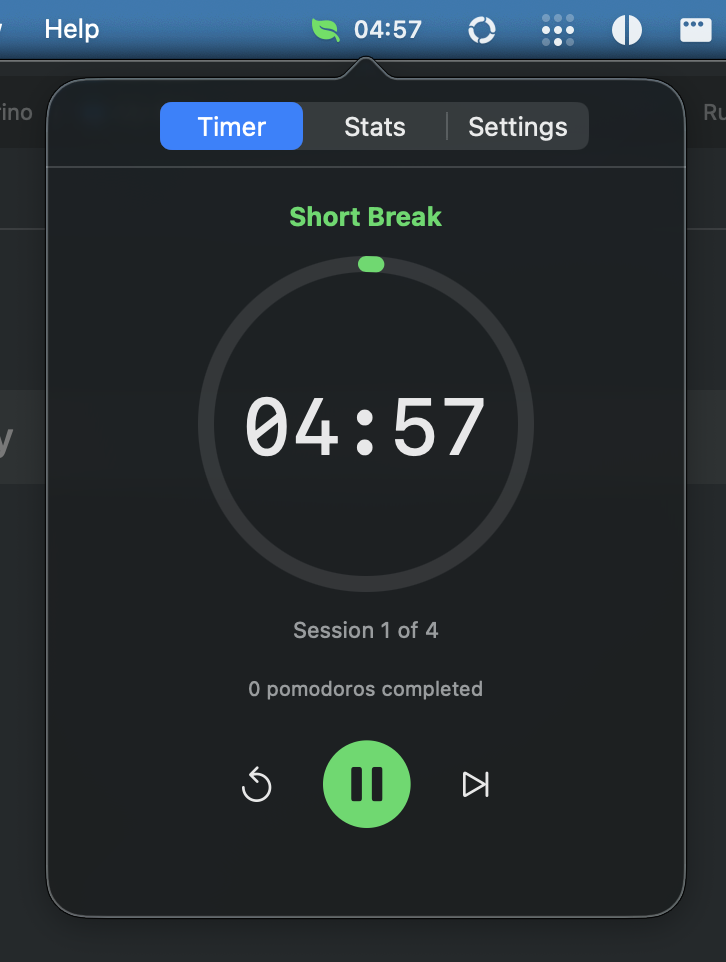
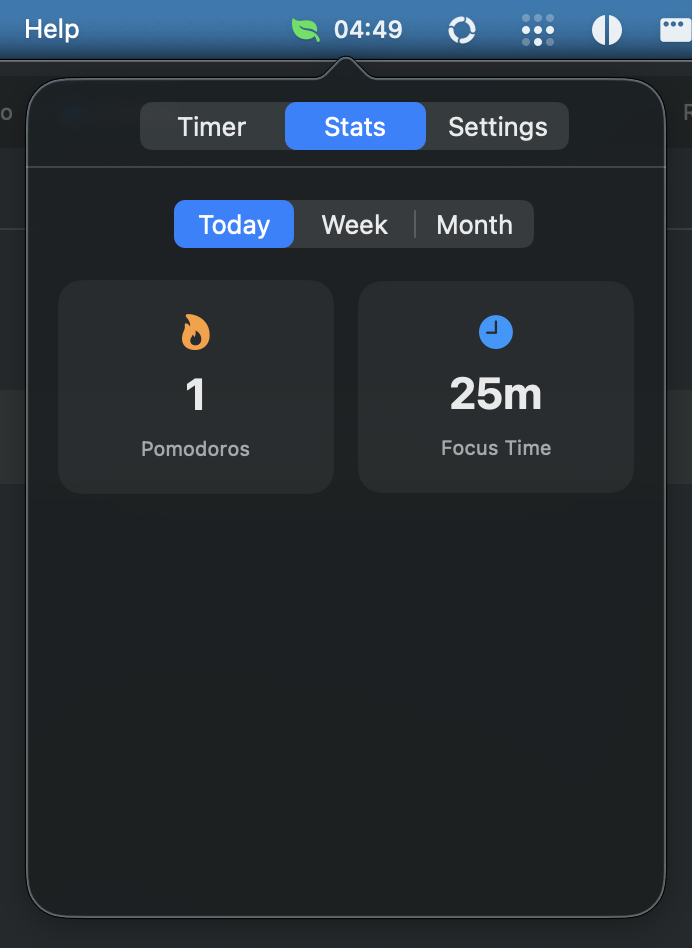
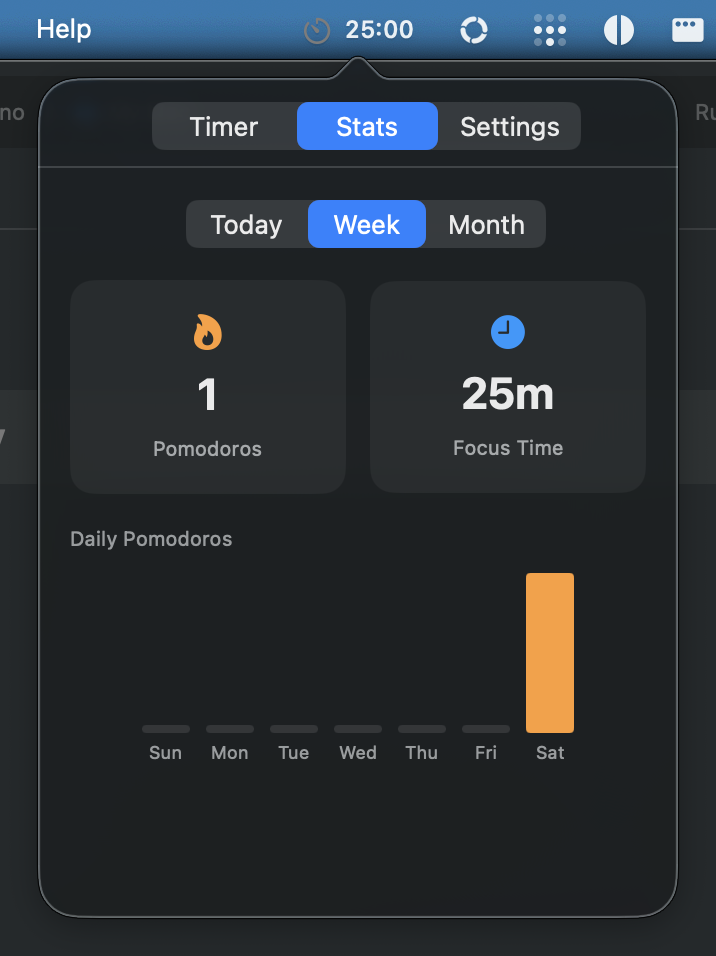
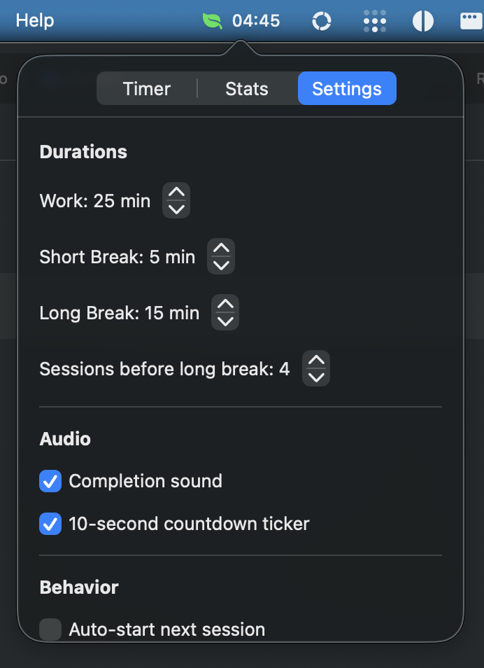
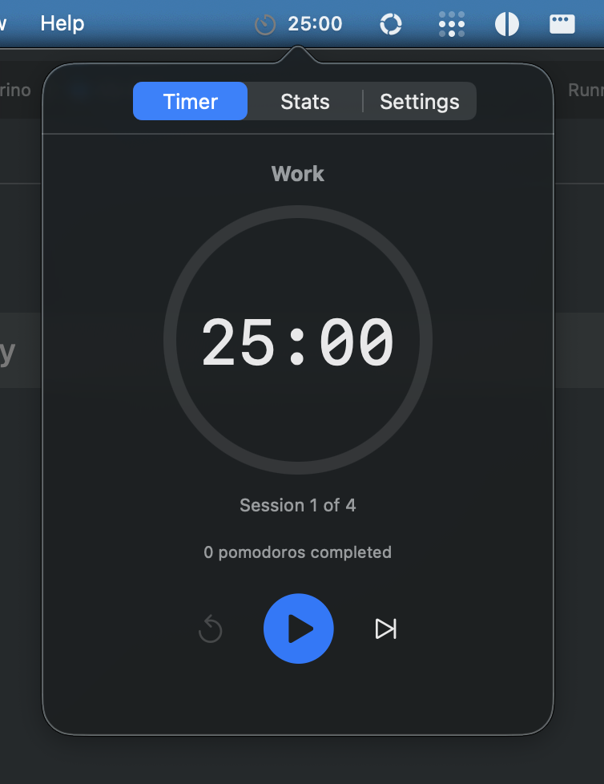

# 🍅 Pomodorino

*A little tomato for your menu bar.*

The Pomodoro timer for people who tried the others and got annoyed.


---

## Screenshots

| | | |
|:---:|:---:|:---:|
|  |  |  |
| Work Session | Break Time | Today's Stats |
|  |  |  |
| Weekly Chart | Settings | Ready to Start |

---

## Why Pomodorino?

Every Pomodoro app eventually becomes bloated. They add task management, team features, integrations, subscriptions, and ads. Pomodorino doesn't.

**Your focus data never leaves your Mac.**

---

## Feature Comparison

| Feature | Pomodorino | TomatoBar | Flow | Session | Be Focused Pro |
|---------|:----------:|:---------:|:----:|:-------:|:--------------:|
| **Price** | Free | Free | $18/yr | $40/yr | $10 × 2 |
| **Ads** | ✗ | ✗ | ✗ | ✗ | ✗ |
| **Open Source** | ✓ | ✓ | ✗ | ✗ | ✗ |
| **Native Swift** | ✓ | ✓ | ✓ | ✓ | ✓ |
| **Menu Bar Timer** | ✓ | ✓ | ✓ | ✓ | ✓ |
| **Global Hotkey** | ✓ | ✓ | ✓ | ✓ | ✓ |
| **Completion Sounds** | ✓ | ✓ | ✓ | ✓ | ✓ |
| **Countdown Ticker** | ✓ | ✗ | ✗ | ✗ | ✗ |
| **Local Analytics** | ✓ | ✗ | ✗ | ✓ | ✓ |
| **Weekly/Monthly Stats** | ✓ | ✗ | ✗ | ✓ | ✓ |
| **100% Local Storage** | ✓ | ✓ | ✗ | ✗ | ✓ |
| **No Account Required** | ✓ | ✓ | ✓ | ✗ | ✓ |
| **Launch at Login** | ✓ | ✓ | ✓ | ✓ | ✓ |
| **App/Web Blocking** | ✗ | ✗ | ✓ | ✓ | ✗ |
| **Task Management** | ✗ | ✗ | ✗ | ✓ | ✓ |
| **iOS Companion** | ✗ | ✗ | ✓ | ✓ | ✓ |
| **iCloud Sync** | ✗ | ✗ | ✓ | ✓ | ✓ |
| **Integrations** | ✗ | ✗ | ✗ | ✓ | ✗ |

**Legend:** ✓ = Yes | ✗ = No

### The Trade-off

Apps like Session and Flow offer more features—but at a cost:
- **Session:** $40/year for task management, sync, and integrations you may not need
- **Flow:** $18/year for app blocking (useful, but bloats a simple timer)
- **Be Focused Pro:** $10 for Mac + $10 for iOS, dated interface

**Pomodorino** gives you analytics and a polished timer with zero recurring cost and zero data leaving your machine. If you just want to focus and track your progress locally, this is it.

---

## Features

- **Menu bar timer** — Always visible countdown
- **One-click controls** — Start, pause, reset, skip
- **Global shortcut** — `⌃⌥P` to toggle from anywhere
- **Completion chimes** — With 10-second countdown ticker
- **Local analytics** — Daily, weekly, monthly stats
- **Launch at login** — Always ready
- **Configurable** — Work/break durations, audio toggle

---

## Install

### From Source

#### Via Install Script
Build and install to `/Applications` in one command (requires Xcode):
```bash
git clone https://github.com/duanecilliers/Pomodorino.git
cd Pomodorino
chmod +x install.sh
./install.sh
```

#### Via Xcode
```bash
git clone https://github.com/duanecilliers/Pomodorino.git
cd Pomodorino
open Pomodorino.xcodeproj
# Build with ⌘B, Run with ⌘R
```

### Download

Grab the latest DMG from [GitHub Releases](https://github.com/duanecilliers/Pomodorino/releases), open it, and drag Pomodorino to Applications.

On its first launch, macOS may ask you to confirm that you want to open an app
from an unidentified developer. Control-click **Pomodorino**, choose **Open**,
then confirm **Open**. This is the normal Gatekeeper flow for an ad-hoc signed
download; it should not report that the app is damaged.

### Homebrew

```bash
brew tap duanecilliers/pomodorino
brew install --cask pomodorino
```

---

## Usage

1. Click the tomato in your menu bar
2. Press **Start**
3. Work for 25 minutes
4. Take a break when it chimes
5. Repeat

After 4 pomodoros, you get a long break. That's it.

**Keyboard shortcut:** `⌃⌥P` toggles start/pause from any app.

---

## Settings

- Work duration (default: 25 min)
- Short break (default: 5 min)
- Long break (default: 15 min)
- Pomodoros before long break (default: 4)
- Auto-start next session
- Audio on/off
- Launch at login

---

## Privacy

Pomodorino collects nothing. Your stats are stored in a local JSON file on your Mac. No analytics. No telemetry. No accounts. No cloud.

---

## Requirements

- macOS 13 (Ventura) or later

---

## License

MIT — do whatever you want.

---

*Built with zero bloat in Cape Town 🇿🇦*
